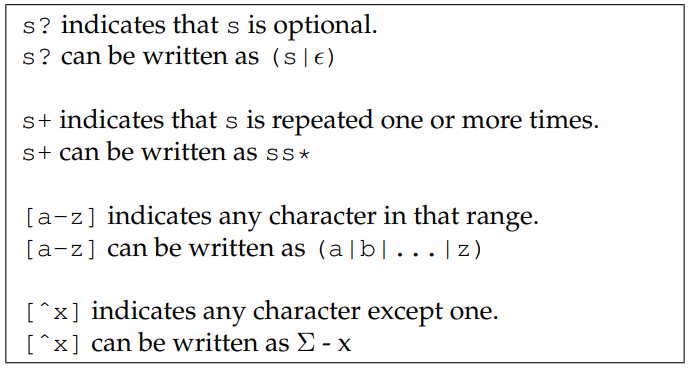

# Scanning

## Kind of Tokens

-   Scanning is the process of identifying **tokens** from the raw text
    source code of a program.

Most languages will have tokens in these categories:

-   Keywords
-   Identifiers
-   Numbers
-   Strings
-   Comments and Whitespace

## A Hand-Made Scanner

-   The basic approach is to read one character at a time from the input
    stream (`fgetc(fp)`) and then classify it.
-   Hand Made scanner is usually verbose.
-   For a complex language with a large number of tokens, we need a more
    formalized approach to defining and scanning tokens. A formal
    approach will allow us to have a greater confidence that token
    definitions do not conflict and the scanner is implemented
    correctly.
-   The formal tools of **regular expressions** and **finite automata**
    allow us to state very precisely what may appear in a given token
    type. Then, automated tools can process these definitions, find
    errors or ambiguities, and produce compact, high performance code.

## Regular Expressions

-   Regular expressions (REs) are a language for expressing patterns.
-   They were first described in the 1950s by Stephen Kleene.

Note that *ϵ* represents empty string.

The syntax described so far is entirely sufficient to write any regular
expression. But, it is also handy to have a few helper operations built
on top of the basic syntax:

