# Parsing

# Overview

-   To parse a computer program, we must first describe the form of
    valid sentences in a language. This formal statement is known as a
    context free grammar (CFG). Because they allow for recursion, CFGs
    are more powerful than regular expressions and can express a richer
    set of structures.
-   LL(1) grammars are CFGs that can be evaluated by considering only
    the current rule and next token in the input stream. This property
    makes it easy to write a hand-coded parser known as a recursive
    descent parser.
-   LR(1) grammars are more general and more powerful than LL(1). Nearly
    all useful programming languages can be written in LR(1) form.
    However, the parsing algorithm for LR(1) grammars is more complex
    and usually cannot be written by hand. Instead, it is common to use
    a parser generator that will accept an LR(1) grammar and
    automatically generate the parsing code.

# Context Free Grammars

## Terminal

-   A **terminal** is a discrete symbol that can appear in the language,
    otherwise known as a **token** from the previous chapter.
-   Examples: keywords, operators and identifiers.
-   Convention: lower-case letters to represent terminals.

## Non terminal

-   A **non-terminal** represents a structure that can occur in a
    language, but is not a literal symbol.
-   Examples: declarations, statements and expressions.
-   Convention: Upper-case letters to represent non terminals: `P` for
    programs, `S` for statement, `E` for expression etc.

## Sentence

-   A **sentence** is a valid sequence of terminals in a language.

## Sentential form

-   A **sentential form** is a valid sequence of terminals and non
    terminals.
-   Convention: Greek symbols to represent sentential forms. Example:
    *α*, *β* and *γ* to represent possibly mixed sequence of terminals
    and non-terminals. We will use a seqence like
    *Y*1*Y*2...*Y**n* to indicate the
    individual symbols in a sentential form: *Y**i* may
    either be a terminal or non terminal.

## Context Free Grammar (CFG)

-   A **CFG** is a list of **rules** that formally describe the
    allowable sentences in a language.
-   The left hand side of each rule is always a single non-terminal.
-   The right hand side of a rule is a **sentential form** that
    describes an allowable form of that non-terminal.
-   Example rule: `A -> xXy` indicates that the non-terminal `A`
    represents a terminal `x` followed by a non-terminal `X` and a
    terminal `y`.
-   The right hand side of a rule can be *ϵ* to indicate that the rule
    produces nothing.
-   The first rule is special: it is the top level definition of a
    program and it's non terminal is known as the **start symbol**

Sample CFG describing expressions involving addition, integers and
identifiers:

[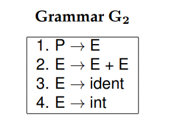](./images/c4_g2.png)

For brevity, the above grammar can also be written as:

E -\> E + E | ident | int

## Deriving Sentences

-   Each grammar describes a (possibly infinite) set of sentences, which
    is known as the **language** of the grammar.
-   To prove that a given sentence is a member of that language, we must
    show that there exists a sequence of rule applications that connects
    the start symbol with the desired sentence.
-   A sequence of rule applications is known as a **derivation** and a
    double arrow (⇒) is used to show that one sentential form is equal
    to another by applying a given rule. Example: E ⇒ int by applying
    rule 4 of grammer G2.

There are two approaches to derivation:

-   top-down: Begin with the start symbol, and then apply rules in the
    CFG to expand non terminals until reaching the desired sentence.
-   bottom-up: Begin with the desired setence, and then apply the rules
    backwards until reaching the start symbol.

For example, `ident + int + int` is a sentence in this language and here
is one top-down derivation to prove it:

[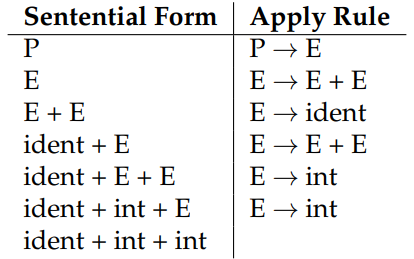](./images/c4_g2_top_down.png)

And similar proof using bottom-up derivation:

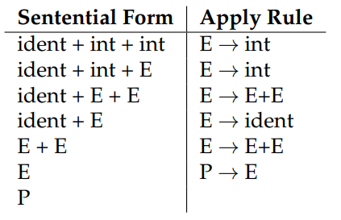

It is quite possible for two different grammars to generate the same
language, in which case we describe them as having **weak equivalence**.

## Ambiguous Grammars

-   An **ambiguous grammar** allows for more than one possible
    derivation of the same sentence.
-   Example: The sentence `ident + int + int` can have two derivations:

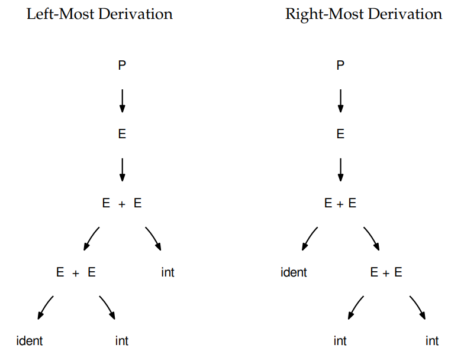

-   Does it matter in the above case ? It certainly does!
-   In a language like Java such a sentence `hello + 5 + 5` could be
    interpreted as either `hello55` or `hello10` and that's not good.
-   It is possible to re-write a grammer so that it is not ambiguous. In
    the common case of binary operators, we can require that one side of
    the expression be an atomic term (T), like this:

-   With this change, the grammer is no longer ambigous. But it still
    accepts the same language as Grammer *G*2
-   If you want to construct a grammar with more operators (division,
    muliplication) - then the usual approach is to construct a grammar
    with multiple levels that reflect the intended precedence of
    operators:

[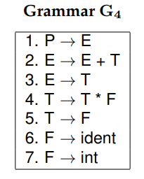](./images/c4_g4.png)

Grammar which supports two if statements (if-then and if-then-else
variant):

[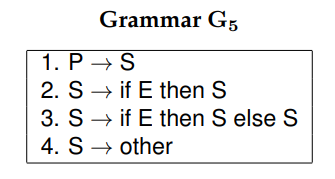](./images/c4_g5.png)

The above grammer is ambiguous because it allows for two derivations of
this sentence:

-   If E then if E then other else other

There are two derivations of this sentence:

-   If E then (if E then other else other)
-   If E then (if E then other) else other

# LL Grammars

-   LL(1) grammars are a subset of CFGs that are easy to parse with
    simple algorithms.
-   A grammar is LL(1) if it can be parsed by considering only one
    non-terminal and the next token in the input stream.

To ensure a grammar is LL(1) we must do the following:

-   Remove any ambiguity as shown above.
-   Eliminate any left recursion.
-   Eliminate any common left prefixes.

## Eliminating Left recursion

LL(1) grammars cannot contain **left recursion** which is a rule of the
form A → A*α* or, more generally, any rule A → B*β* such that B ⇒ A*γ*
by some sequence of derivations.

## Eliminating Common Left Prefixes

[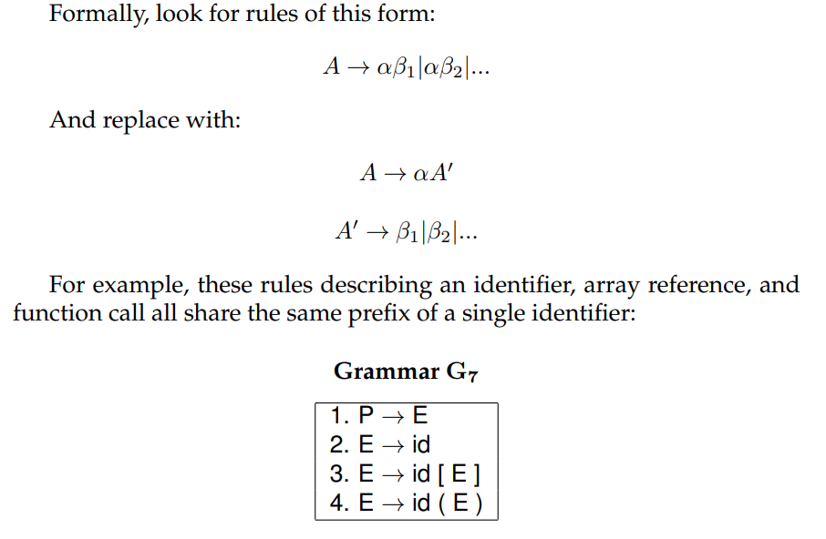](./images/c4_elim_comm_prefix_1.png)

Fixing the grammar will result in:

## First and Follow Sets

-   In order to construct a complete parser for an LL(1) grammar, we
    must compute two sets, known as `FIRST` and `FOLLOW`.
-   Informally, FIRST(*α*) indicates the set of terminals (including
    *ϵ*) that could potentially appear at the beginning of any
    **derivation** of *α*.
-   FOLLOW(A) indicates the set of terminals (including $) that could
    potentially occur after any derivation of non-terminal A.
-   Given the contents of these two set, the LL(1) parser will always
    know `which rule to pick next`.

*Y*1...*Y**n* − 1 ⇒ *ϵ* means
*ϵ* ∈ FIRST(*Y*1)...*ϵ* ∈ FIRST(*Y**n* − 1)

[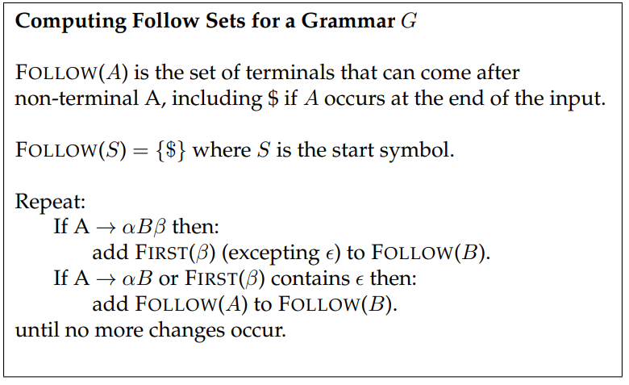](./images/c4_follow_sets.png)

I also found the following source very helpful:

-   [jambe.con.nz
    source](https://www.jambe.co.nz/UNI/FirstAndFollowSets.html) (For
    first sets)
-   [cs.ecu.edu
    source](http://www.cs.ecu.edu/karl/5220/spr16/Notes/Top-down/follow.html)
    [Archive
    link](https://web.archive.org/web/20190203020902/http://www.cs.ecu.edu/karl/5220/spr16/Notes/Top-down/follow.html)
    (For follow set, example specifically)

I personally found that working out the examples, let me to understand
the above algorithm better. Always going back to the informal definition
above will help you. Now let's see an example:

You can also use this [Haskell
module](https://hackage.haskell.org/package/context-free-grammar-0.1.1/docs/Data-Cfg-Analysis.html)
to find them. (Future todo: Write a blog post about it)

Let's find out the First sets initially. Let's try to find out
**FIRST(P)**. Going back to the formal definition:

**FIRST(P)** is the set of terminals that being all strings given by
**P**. Looking at the grammar, it is hard to come up for non terminal
\*\*P\* since it depens on other non terminals. Let's try to move from
\*the non terminals at the end of the grammar:

-   FIRST(F) = {(, int}
-   FIRST(T') = {\*, ϵ }
-   FIRST(T) = {(, int } (Same as the first set of F)
-   FIRST(E') = {ϵ, +}
-   FIRST(E) = {(, int } (Same as the first set of T)
-   FIRST(P) = {(, int } (Same as the first set of E)

Now let's find out the Follow sets. Let's try to find out **FOLLOW(P)**.
Going back to the formal definition:

**FOLLOW(P)** is the set of terminal that can come after non-terminal
**P**, including $ if P occurs at the end of input.

-   FOLLOW(P) = {$} (P represents the program and it includes $ since P
    occurs at the end of input).
-   FOLLOW(E) = {),$} (For $, same logic as above)
-   FOLLOW(E') = {),$} (F =\> (E) =\> (TE'), so it includes **)**)
-   FOLLOW(T) = {),$, +}
    -   Same as FOLLOW(E') since E -\> TE'
    -   Also includes `+` since E =\> TE' =\> T+TE'
-   FOLLOW(T') = {),$, +}
    -   E =\> TE' =\> FT'E'. So same as FOLLOW(E')
    -   FT'E' =\> FT'+TE', so includes +
-   FOLLOW(F) = {),$,+,\*}
    -   Same as FOLLOW(T') since T =\> FT'
    -   Also includes `*` since FT' =\> F\*FT'

## Recursive Descent Parsing

-   LL(1) grammars are very amenable to write simple hand-coded parsers.
-   A common approach is a **recursive descent parser** in which there
    is one simple function for each non-terminal in the grammar. The
    body of the function follow the right hand sides of the
    corresponding rules: non-terminal results in a call to another parse
    function, while terminals result in considering the next token.

## Table Driven Parsing

-   An LL(1) grammar can also be parsed using generalized table driven
    code.
-   A table driven parser requires a grammar, a parse table and a stack
    to represent the current set of non-terminals.
-   The **LL(1) parse table** is used to determine which rule should be
    applied for any combination of non-terminal on the stack and next
    token on the input stream.

[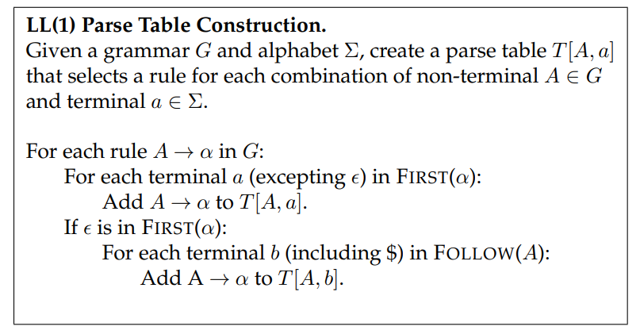](./images/c4_l1_parse_table.png)

# LR Grammars

-   While LL(1) grammars and top-down parsing techniques are easy to
    work with, they are not able to represent all of the structures
    found in many programming languages. For more general-purpose
    programming languages, we must use an LR(1) grammar and associated
    bottom-up parsing techniques.
-   LR(1) is the set of grammars that can be parsed via shift-reduce
    techniques with a single character of lookahead.
-   LR(1) is a super-set of LL(1) and can accommodate left recursion and
    common left prefixes which are not permitted in LL(1).

Example of LR(1) grammar:

[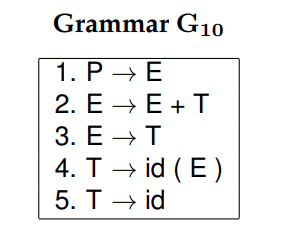](./images/c4_g10.png)

And it's first and follow sets are these:

## Shift Reduce Parsing

-   LR(1) grammars must be parsed using the **shift-reduce** parsing
    technique. This is a bottom-up parsing strategy that begins with the
    tokens and looks for rules that can be applied to reduce sentential
    forms into non-terminals. If there is a sequence of reductions that
    leads to the start symbol, then the parse is successful.
-   A **shift** action consumes one token from the input stream and
    pushes it onto the stack.
-   A **reduce** action applies one rule of the form *A* → *α* from the
    grammar, replacing sentential form *α* on the stack with the non
    terminal *A*.

Example of shift-reduce parse of the sentence `id(id+id)` using Grammar
*G*10:

[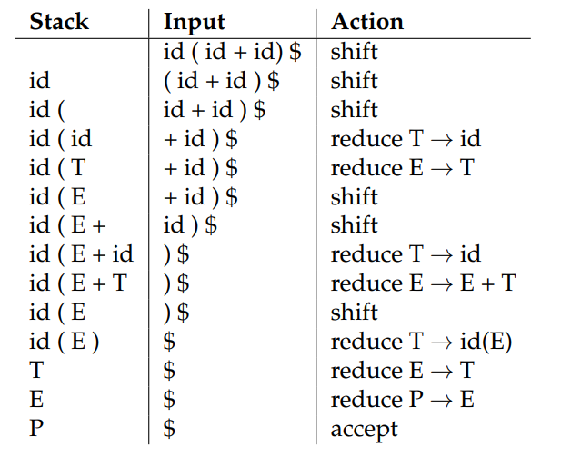](./images/c4_shift_reduce.png)

In the above example, you can see that there is some action chosen at
each step. To understand how these decisions are made, we must analyze
LR(1) grammars in more detail.

## The LR(0) Automaton

-   An **LR(0) automaton** represents all the possible rules that are
    currently under consideration by a shift-reduce parser.
-   Each state in the automaton consists of multiple **items**, which
    are rules augmented by a **dot(.)** that indicates the parser's
    current position in that rule. For example, the configuration
    *E* → *E*. + *T* indicates that *E* is currently on the stack, and
     + *T* is a possible next sequence of tokens.
-   The automaton is constructed as follows. State 0 is created by
    taking the production for the start symbol (*P*→*E*) and adding a
    dot at the beginning of the right hand. This indicates that we
    expect to see a complete program, but have not yet consumed any
    symbols. This is known as the **kernel** of the state.

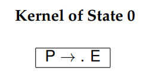

-   Then, we compute the **closure** of the state as follows. For each
    item in the state with a non-terminal *X* immediately to the right
    of the dot, we add all the grammar that have X as the left hand
    side. The newly added items have a dot at the beginning of the right
    hand side.

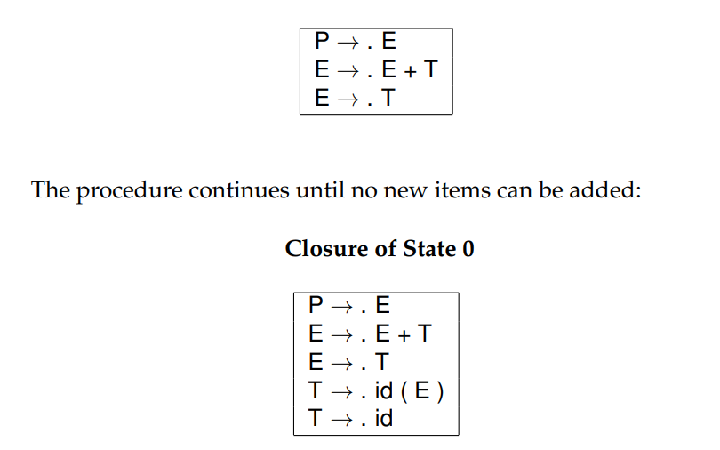

-   From this state, all of the symbols (terminals and non-terminals
    both) to the right of the dot are possible outgoing transitions. If
    the automaton takes that transition, it moves to a new state
    containing the matching items, with the dot moved one position to
    the right. The closure of the new state is computed, possibly adding
    new rules as described above.

-   The LR(0) automaton tells us the choices available at any step of
    bottom up parsing. When we reach a state containing an item with a
    dot at the end of the rule, that indicates a possible reduction. A
    transition on a terminal that moves the dot one position to the
    right indicates a possible shift. While the LR(0) automaton tells us
    the available actions at each step, it does not always tell us
    `which` action to take.

Two types of conflict can appear in an LR grammar:

-   A **shift-reduce conflict** indicates a choice between a shift
    action and a reduce action. Example: State 4 in the above automaton

[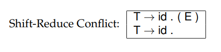](./images/c4_shift_reduce_conflict.png)

-   A **reduce-reduce conflict** indicates that two distinct rules have
    been completely matched, and either one could apply.

The LR(0) automaton forms the basis of LR parsing, by telling us which
actions are available in each state. But, it does not tell us which
action to take or how to resolve shift-reduce and reduce-reduce
conflicts. To do that, we must take into account some additional
information.

## SLR Parsing

-   **Simple LR(SLR)** parsing is basic form of LR parsing in which we
    use `FOLLOW` sets to resolve conflicts in the `LR(0)` automaton.
-   In short, we take the reduction *A* → *α* only when the next token
    on the input is in `FOLLOW(A)`. If a grammar can be parsed by this
    technique, we say it is an **SLR grammar**, which is a subset of
    LR(1) grammars.
-   Taking the example in the above automaton for State 4, there are two
    possible cases:
    -   If the next token is `(`, then we shift to state 5.
    -   If the next token is `+,)` or `$`, then we reduce by the rule `T
         -> id`.
-   These decisions are encoded in **SLR parse tables** which are
    historically known as **GOTO** and **ACTION**.

todo: insert picture (SLR parse table creation)

Let's follow the above algorithm to construct SLR parse table ourselves
for grammar *G*10. Some conventions to keep in mind:

-   Rn: n represents the Rule number (to which it has to reduce to).
-   Sn: n represents the state number (to which it has to shift to).
-   Gn: n represents the state number (to which it has to goto).

The easy way to compute is to look at the LR(0) Automaton for the
grammar.

### State 0

The core idea of the above algorithm is that you create the **ACTION**
table for the terminals and the **GOTO** table for non terminals. Using
that let's construct the table for state zero:

-   A\[0, id\] = S4
-   G\[0, E\] = G1
-   G\[0, T\] = G8

### State 1

-   Follow(P) = $
-   A\[1, +\] = S2
-   A\[0, $\] = R1

### State 2

-   G\[2, T\] = G3
-   A\[2, id\] = S4

### State 3

-   Follow(E) = {$, ), +}
-   A\[3, $\] = R2
-   A\[3, )\] = R2
-   A\[3, +\] = R2

### State 4

-   Follow(T) = {$, ), +}
-   A\[4, (\] = S5
-   A\[4, $\] = R5
-   A\[4, )\] = R5
-   A\[4, +\] = R5

### State 5

-   A\[5, id\] = S4
-   G\[5, E\] = G6
-   G\[5, T\] = G8

### State 6

-   A\[6, +\] = S2
-   A\[6, )\] = S7

### State 7

-   Follow(T) = {$, ), +}
-   A\[7, $\] = R4
-   A\[7, )\] = R4
-   A\[7, +\] = R4

### State 8

-   Follow(E) = {$, ), +}
-   A\[8, $\] = R3
-   A\[8, +\] = R3
-   A\[8, )\] = R3

And that corresponds with the SLR parse table given in the book:

todo: insert pic (SLR parse table for Grammer g10)

todo: insert pic (SLR parsing algorithm)

todo: insert pic (table, page 57)

Let's try to follow the first four steps of the above algorithm:

### Step 1

-   Stack: 0
-   Top of Stack: 0
-   Token: id
-   SLR parse table result = S4

### Step 2

-   Stack: 0 4
-   Top of Stack: 4
-   Token: (
-   SLR parse table result = S5

### Step 2

-   Stack: 0 4 5
-   Top of Stack 5
-   Token: id
-   SLR parse table result = S4

### Step 3

-   Stack: 0 4 5 4
-   Top of Stack 4
-   Token: +
-   SLR parse table result = R5
    -   It's reduce (T-\>id), pop state from stack.
    -   s = top element from stack
    -   Goto\[5, T\] = G8
    -   New stack: 0 4 5 8

## Limitation

-   SLR is a subset of LR(1), and not all LR(1) grammars are SLR.

todo: insert pic(page 58, g 11 grammar)

-   FOLLOW(S) = {$} and FOLLOW(V) = {=\]$}
-   In state 1, we can reduce by S -\> id or V -\> id. However, both
    FOLLOW(S) and FOLLOW(V ) contain $, so we cannot decide which to
    take when the next token is end-of-file. Even using the FOLLOW sets,
    there is still a reduce-reduce conflict. Therefore, Grammar G11 is
    not an SLR grammar
-   But, if we look more closely at the possible sentences allowed by
    the grammar, the distinction between the two becomes clear. Rule `S
     -> id` would only be applied in the case where the complete
    sentence is `id$`. If any other character follows, we apply
    `V -> id`. So the grammar is not ambigous, we need a more powerful
    parser.

# LR(1) Parsing

-   The LR(1) automaton is like the LR(0) automaton, except that each
    item is annotated with the set of tokens that could potentially
    follow it, given the current parsing state.
-   This set is known as the lookahead of the item. The lookahead is
    always a subset of the FOLLOW of the relevant non-terminal.

todo: insert pic(page 59)

todo: insert pic (page 60)

-   Now you can see how the lookahead solves the reduce-reduce conflict.

todo: inser pic (page 61)

One aspect of state zero is worth clarifying. When constructing the
closure of a state, we must consider all rules in the grammar, including
the rule corresponding to the item under closure. The item E -\> .E + T
is initially added with a lookahead of {$}. Then, evaluating that item,
we add all rules that have E on the left hand side, adding a lookahead
of {<s>}. So, we add E -\> . E + T again, this time with a lookahead of
{</s>}, resulting in a single item with a lookahead set of {$, +}

# LALR Parsing

-   The main downside to LR(1) parsing is that the LR(1) automaton can
    be much larger than the LR(0) automaton.
-   Any two states that have the same items but differ in lookahead sets
    for any items are considered to be different states. The result is
    enormous parse tables that consume large amounts of memory and slow
    down the parsing algorithm.
-   **Lookahead LR (LALR)** parsing is the practical answer to this
    problem.
-   To construct an LALR parser, we first create the LR(1) automaton,
    and then merge states that have the same core. The core of a state
    is simply the body of an item, ignoring the lookahead.
-   When several LR(1) items are merged into one LALR item, the LALR
    lookahead is the union of the lookaheads of the LR(1) items.

todo: insert pic (62)

-   The resulting LALR automaton has the same number of states as the
    LR(0) automaton, but has more precise lookahead information
    available for each item.

# Grammar Classes Revisited

todo: insert pic (62)

## CFG

-   A context-free grammar is any grammar whose rules have the form A →

α.

-   To parse any CFG, we require a finite automaton (a parse table) and

a stack to keep track of the parse state.

-   An arbitrary CFG can be ambiguous. An ambiguous CFG will result in a
    non-deterministic finite automaton, which is not practical to use.

## LR(k)

-   An LR(k) parser performs a bottom-up \*L\*eft to right scan of the
    input and provides a \*R\*ight-most parse, deciding what rule to
    apply next by examining the next `k` tokens on the input.
-   A canonical LR(1) parser requires a very large finite automaton,
    because the possible lookaheads are encoded into the states.
-   While strictly a subset of CFGs, nearly all realworld language
    constructs can be expressed adequately in LR(1).

## LALR

-   A Lookahead-LR parser is created by first constructing a canonical
    LR(1) parser, and then merging all itemsets that have the same core.
-   This yields a much smaller finite automaton, while retaining some
    detailed lookahead information.
-   While less powerful than canonical LR(1) in theory, LALR is usually
    sufficient to express real-world languages.

## SLR

-   A Simple-LR parser approximates an LR(1) parser by constructing the
    LR(0) state machine, and then relying on the FIRST and FOLLOW sets
    to select which rule to apply.
-   SLR is simple and compact, but there are easy-to-find examples of
    common constructs that it cannot parse.

## LL(k)

-   An LL(k) parser performs a top-down \*L\*eft to right scan of the
    input and provides a \*L\*eft-most parse, deciding what rule to
    apply next by examining the next `k` tokens on the input.
-   LL(1) parsers are simple and widely used because they require a
    table that is only O(nt) where t is the number of tokens, and n is
    the number of non-terminals
-   LL(k) parsers are less practical for k \> 1 because the size of the
    parse table is O(n (tk) ) in the worst case.
-   They often require that a grammar be rewritten to be more amenable
    to the parser, and are not able to express all common language
    structures.

# The Chomsky Hierarchy

-   Named after noted linguist Noam Chomsky.
-   The hierarchy describes four categories of languages (and
    corresponding grammars) and relates them to the abstract computing
    machinery necessary to recognize such a language.

todo: insert pic (page 64)

## Regular Languages

-   Regular languages are those described by regular expressions.
-   Every regular expression corresponds to a finite automaton that can
    be used to identify all words in the corresponding language.
-   As you know, a finite automaton can be implemented with the very
    simple mechanism of a table and a single integer to represent the
    current state. So, a scanner for a regular language is very easy to
    implement efficiently.

## Context Free languages

-   Context free languages are those described by context free grammars
    where each rule is of the form A → γ, with a single non-terminal on
    the left hand side, and a mix of terminals and non-terminals on the
    right hand side.
-   We call these “context free” because the meaning of a non-terminal
    is the same in all places where it appears.
-   As you have learned in this chapter, a CFG requires a pushdown
    automaton, which is achieved by coupling a finite automaton with a
    stack.

## Context sensitive languages

-   Context sensitive languages are those described by context sensitive
    grammars where each rule can be of the form αAβ → αγβ.
-   We call these “context sensitive” because the interpretation of a
    non-terminal is controlled by context in which it appears.
-   Context sensitive languages require a non-deterministic linear
    bounded automaton, which is bounded in memory consumption, but not
    in execution time.
-   Context sensitive languages are not very practical for computer
    languages.

## Recursively enumerable languages

-   Are the least restrictive set of languages, described by rules of
    the form α → β where α and β can be any combination of terminals and
    non-terminals.
-   These languages can only be recognized by a full Turing machine, and
    are the least practical of all.

The Chomsky Hierarchy is a specific example of a more general principle
for the design of languages and compilers:

**The least powerful language gives the strongest guarantees.**

That is to say, if we have a problem to be solved, it should be attacked
using the least expressive tool that is capable of addressing the
problem. If we can solve a given problem by employing REs instead of
CFGs, then we should use REs, because they consume less state, have
simpler machinery, and present fewer roadblocks to a solution.

The same advice applies more broadly: assembly language is the most
powerful language available in our toolbox and is capable of expressing
any program that the computer is capable of executing. However, assembly
language is also the most difficult to use because it gives none of the
guarantees found in higher level languages. Higher level languages are
less powerful than assembly language, and this is what makes them more
predictable, reliable, and congenial to use.
